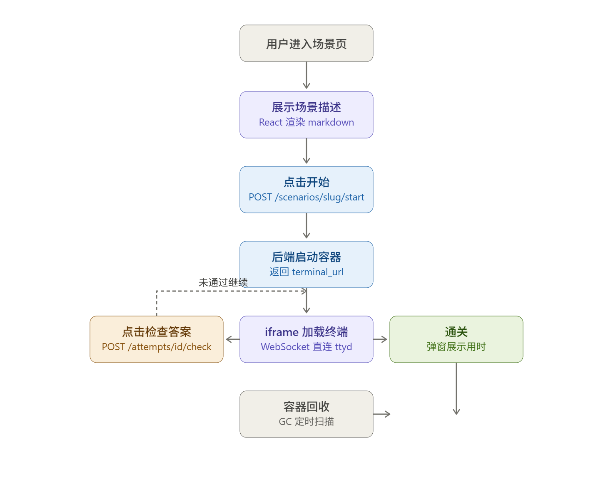
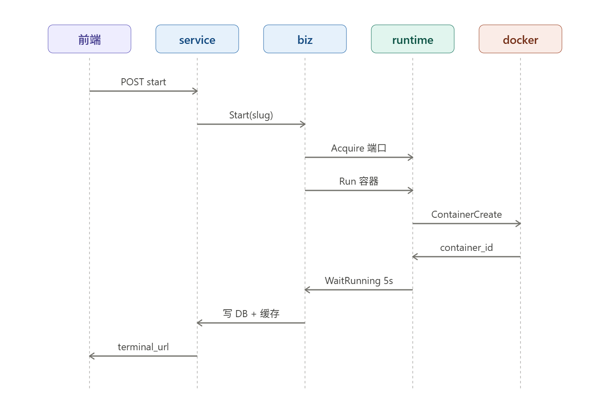

<!--
 * @Author: chengjiang
 * @Date: 2026-04-20 17:23:43
 * @Description: 
-->
# opslabs
一款场景模拟练习场, TODO： ai 陪练

# 目录
- backend // 项目后端
- frontend // 客户端
- adminweb // 管理端
- deploy // 部署文件，sql文件等。
- script // 脚本

# 设计

## step

1  骨架        容器 + ttyd + 3个核心 API            ✓ 场景 1 本地可玩
2  全联通      前端 + 用户系统 + 场景 2/3            ✓ 3 场景端到端
3  打磨        场景 4/5 + 反馈 + 基础监控            ✓ 5 场景齐全
4  内测        20 人邀请制 + 录屏 + 快速迭代         ✓ 完成率/满意度达标
5  公开        掘金/V2EX/即刻/B站 冷启动             ✓ 500 访问
6-7  迭代       按数据优化场景难度 + UX              ✓ 留存 > 15%
8  付费验证    3 个 Pro 场景 + 点击率测试            ✓ 解锁点击 > 5%

# 第一阶段
好,我按这个思路重写 Week 1 文档——架构覆盖前后端,细节收敛到结构体、接口、流程图层面。

---

# FixIt Week 1 开发文档 · 骨架跑通

> **本周目标**:从浏览器到容器的完整链路跑通。用户在 React 页面点"开始",后端分配一个 Linux 容器,浏览器内嵌终端可直接操作,点"检查答案"返回通关结果。

---

## 1. 项目概述

### 1.1 项目背景

FixIt 是一个浏览器内的 Linux 排障练习平台。第一周只做一件事——**把技术路线跑通**,证明"浏览器终端 + 容器化场景 + 自动判题"这条主链路可行。

### 1.2 设计目标

- 一个可玩的引导场景(hello-world)
- React 前端能展示场景、嵌入终端、触发判题
- Kratos 后端提供场景启动、查询、判题、结束 4 个接口
- 容器隔离、自动回收、端口动态分配
- 同时支持 3 个用户并发

### 1.3 本周不做

- 用户登录、鉴权
- 分级提示
- 多场景(只做 hello-world)
- 前端样式库(Tailwind 裸用,不引 UI 组件库)
- 生产部署、CI/CD

---

## 2. 业务功能需求

### 2.1 核心功能清单

| 编号 | 功能 | 前端 | 后端 |
|---|---|---|---|
| F1 | 场景详情展示 | ✅ | - |
| F2 | 点击"开始"启动容器 | ✅ | ✅ |
| F3 | 浏览器内操作终端 | ✅ | - |
| F4 | 点击"检查答案"判题 | ✅ | ✅ |
| F5 | 通关反馈展示 | ✅ | ✅ |
| F6 | 手动结束场景 | ✅ | ✅ |
| F7 | 动态端口分配 | - | ✅ |
| F8 | 容器超时自动回收 | - | ✅ |
| F9 | attempts 落库 | - | ✅ |

### 2.2 非功能需求

- 启动延迟 < 5s
- 并发 3 个场景稳定运行
- 单容器资源:内存 512MB、CPU 0.5 核

### 2.3 验收标准

打开浏览器 → 看到场景页 → 点"开始" → 终端出现 → 按提示操作 → 点"检查答案" → 看到通关界面。全程无报错,数据库有一条 status=passed 记录。

---

## 3. 技术架构

### 3.1 整体架构

```
┌──────────────────────────────────────────────────────────────┐
│                         浏览器                                │
│  ┌────────────────────────┐  ┌──────────────────────────┐   │
│  │  React 页面             │  │  ttyd iframe             │   │
│  │  (场景描述 + 判题按钮)  │  │  (WebSocket 接容器 shell)│   │
│  └────────────────────────┘  └──────────────────────────┘   │
└──────────────────────┬────────────────────┬──────────────────┘
                       │ HTTP API           │ WebSocket
                       │                    │
           ┌───────────▼──────────┐         │
           │   Kratos HTTP Server │         │
           │   (业务 API)          │         │
           └───────────┬──────────┘         │
                       │                    │
           ┌───────────▼──────────┐         │
           │   Runtime 层          │         │
           │   (Docker SDK)        │         │
           └───────────┬──────────┘         │
                       │                    │
           ┌───────────▼────────────────────▼──────────┐
           │         Docker 守护进程                    │
           │  ┌─────────────┐  ┌─────────────┐         │
           │  │ 场景容器 A   │  │ 场景容器 B   │ ...     │
           │  │ ttyd:7681   │  │ ttyd:7681   │         │
           │  │ check.sh    │  │ check.sh    │         │
           │  └─────────────┘  └─────────────┘         │
           └────────────────────────────────────────────┘

           ┌──────────────────────┐
           │  PostgreSQL          │  (attempts 表)
           └──────────────────────┘
```

**关键设计**:
- 前端到后端走 HTTP(JSON API)
- 前端到容器终端**直接走 WebSocket**(不经后端转发),ttyd 的宿主机端口由后端动态分配后告诉前端
- 判题不是前端直接调容器,是前端调后端 API,后端通过 Docker SDK exec 进容器跑 check.sh

### 3.2 技术栈

| 层 | 技术 | 说明 |
|---|---|---|
| 前端 | React 18 + Vite + TypeScript | 已确定 |
| 前端样式 | Tailwind CSS | 快速出 UI |
| 前端状态 | React Query + Zustand | API 请求缓存 + 会话状态 |
| 终端嵌入 | `<iframe>` 加载 ttyd | V1 最简方案,不用 xterm.js |
| 后端框架 | Kratos + GORM | 已确定 |
| 配置 | YAML | 已确定 |
| 数据库 | PostgreSQL | 只有 attempts 一张表 |
| 容器运行时 | Docker(Docker SDK for Go) | 单机,不上 K8s |
| 终端服务 | ttyd 1.7.7 | 容器内运行,暴露 7681 |

### 3.3 前端技术架构

```
前端应用
├── 路由层 (React Router)
│   ├── /                  首页(场景入口)
│   └── /scenarios/:slug   场景详情 + 终端 + 判题
│
├── 页面组件 (pages/)
│   ├── Home.tsx
│   └── Scenario.tsx       ← 本周核心
│
├── 功能组件 (components/)
│   ├── Terminal.tsx       封装 ttyd iframe
│   ├── CheckButton.tsx    带加载态的判题按钮
│   ├── PassModal.tsx      通关提示弹窗
│   └── ScenarioMeta.tsx   左侧描述面板
│
├── API 层 (api/)
│   └── attempt.ts         后端接口封装(React Query hooks)
│
├── 状态层 (store/)
│   └── useAttemptStore.ts 当前 attempt 信息(id, terminal_url, status)
│
└── 类型定义 (types/)
    └── attempt.ts         TS 类型镜像后端 proto
```

**关键技术决策**:

1. **终端用 iframe 而非 xterm.js**:ttyd 自带完整前端,V1 直接 iframe 省心。V2 如果要自定义样式或监听命令,再换 xterm.js 直连 ttyd 的 WebSocket。
2. **一个 attempt = 一个浏览器标签**:不做多 attempt 并行 UI,关掉标签即离开场景。
3. **React Query 负责轮询状态**:场景进行中每 10 秒 GET 一次 attempt 状态,保持后端 `last_active_at` 更新。
4. **Tailwind 原子类直接写**:不抽样式组件,V1 不追求设计感。

### 3.4 后端技术架构

Kratos 标准分层:

```
api/fixit/v1/           proto 定义(接口契约)
internal/
├── service/            service 层,pb ↔ biz 转换
├── biz/                业务逻辑(AttemptUsecase)
├── data/               GORM repo
├── runtime/            Docker 封装(本项目独有)
│   ├── docker.go       容器 Run/Stop/Exec
│   ├── portpool.go     端口池
│   └── exec.go         判题执行
├── store/              内存 AttemptStore(热缓存)
├── scenario/           场景元信息注册表(硬编码)
├── task/               GC 后台任务
└── server/             HTTP Server 注册
```

**关键技术决策**:

1. **内存 + DB 双写**:GC 扫描高频,全走内存;持久化写 DB。重启时从 DB 恢复内存。
2. **GC 实现为 transport.Server**:接入 Kratos app 生命周期,优雅启停。
3. **端口池**:预分配 10000-19999,避免每次随机 + 探测。
4. **场景元信息本周硬编码**:下周再放数据库。

### 3.5 部署架构(本地开发)

```
开发机
├── Docker Engine
│   ├── 网络: fixit-scenarios (独立 bridge)
│   └── 容器: 多个场景实例
├── PostgreSQL (本地或 docker 起)
└── Kratos 进程 (kratos run)

浏览器
└── Vite dev server (localhost:5173)
    └── API 请求代理到 localhost:8000
    └── terminal iframe 直连 localhost:<动态端口>
```

Vite 代理配置要点:

```
/api/* → http://localhost:8000
```

terminal URL 不走代理,后端直接返回 `http://localhost:10042` 之类,iframe 直连。

---

## 4. 流程设计

### 4.1 用户核心流程



### 4.2 场景启动时序



### 4.3 判题与回收

判题:前端 POST `/attempts/:id/check` → biz 层 → `docker exec check.sh` → 解析 stdout 首行 == "OK" 且 exit 0 → 通关则写 DB 更新 status=passed + duration_ms。

回收:后台 goroutine 每 60s 扫描内存 AttemptStore,`running` 且空闲 30 分钟、或 `passed` 满 10 分钟,销毁容器并释放端口。

---

## 5. 数据结构(核心)

### 5.1 后端 GORM 模型

```go
type AttemptStatus string

const (
    StatusRunning    AttemptStatus = "running"
    StatusPassed     AttemptStatus = "passed"
    StatusExpired    AttemptStatus = "expired"
    StatusTerminated AttemptStatus = "terminated"
)

type Attempt struct {
    ID           string         `gorm:"primaryKey;type:varchar(32)"`
    ScenarioSlug string         `gorm:"type:varchar(64);index;not null"`
    ContainerID  string         `gorm:"type:varchar(128)"`
    HostPort     int            `gorm:"not null"`
    Status       AttemptStatus  `gorm:"type:varchar(16);index;not null"`
    StartedAt    time.Time      `gorm:"not null"`
    LastActiveAt time.Time      `gorm:"index;not null"`
    FinishedAt   *time.Time
    DurationMS   *int64
    CreatedAt    time.Time
    UpdatedAt    time.Time
    DeletedAt    gorm.DeletedAt `gorm:"index"`
}
```

### 5.2 后端内存态

```go
// 内存热缓存,GC 扫描用,进程重启时从 DB 恢复
type CachedAttempt struct {
    ID           string
    ScenarioSlug string
    ContainerID  string
    HostPort     int
    Status       string
    StartedAt    time.Time
    LastActiveAt time.Time
    FinishedAt   *time.Time
}

// 端口池
type PortPool struct {
    mu   sync.Mutex
    free []int
    used map[int]bool
}

// 场景元信息(硬编码注册表)
type Scenario struct {
    Slug        string
    Title       string
    DockerImage string
    CheckScript string
}
```

### 5.3 前端 TypeScript 类型

```typescript
export type AttemptStatus = 'running' | 'passed' | 'expired' | 'terminated'

export interface Attempt {
  attemptId: string
  scenarioSlug: string
  status: AttemptStatus
  terminalUrl: string
  startedAt: string       // ISO 8601
  lastActiveAt: string
}

export interface StartScenarioResponse {
  attemptId: string
  terminalUrl: string
  expiresAt: string
}

export interface CheckResponse {
  passed: boolean
  message: string
  durationSeconds?: number
}

export interface Scenario {
  slug: string
  title: string
  descriptionMd: string
}
```

### 5.4 前端状态结构(Zustand)

```typescript
interface AttemptState {
  current: Attempt | null
  isStarting: boolean
  isChecking: boolean
  passedResult: CheckResponse | null

  startScenario: (slug: string) => Promise<void>
  checkAnswer: () => Promise<void>
  terminateAttempt: () => Promise<void>
  reset: () => void
}
```

---

## 6. 接口定义

### 6.1 启动场景

```
POST /v1/scenarios/:slug/start
```

Response:
```json
{
  "attemptId": "a1b2c3d4e5f6g7h8",
  "terminalUrl": "http://localhost:10042",
  "expiresAt": "2026-04-20T15:30:00Z"
}
```

### 6.2 查询状态

```
GET /v1/attempts/:id
```

Response:
```json
{
  "attemptId": "a1b2c3d4e5f6g7h8",
  "scenarioSlug": "hello-world",
  "status": "running",
  "terminalUrl": "http://localhost:10042",
  "startedAt": "2026-04-20T15:00:00Z",
  "lastActiveAt": "2026-04-20T15:05:23Z"
}
```

前端每 10 秒轮一次,同时起到心跳作用(后端更新 last_active_at)。

### 6.3 检查答案

```
POST /v1/attempts/:id/check
```

Response:
```json
{
  "passed": true,
  "message": "恭喜通关!",
  "durationSeconds": 187
}
```

### 6.4 手动结束

```
POST /v1/attempts/:id/terminate
```

Response:
```json
{ "status": "terminated" }
```

### 6.5 场景详情(前端渲染用)

```
GET /v1/scenarios/:slug
```

Response:
```json
{
  "slug": "hello-world",
  "title": "欢迎来到 FixIt",
  "descriptionMd": "# 欢迎来到 FixIt\n\n在你当前登录..."
}
```

### 6.6 错误返回

Kratos 的 errors 标准格式。错误码:

| Reason | HTTP | 含义 |
|---|---|---|
| SCENARIO_NOT_FOUND | 404 | 场景 slug 不存在 |
| ATTEMPT_NOT_FOUND | 404 | attempt id 不存在 |
| ATTEMPT_NOT_RUNNING | 409 | 状态不对,已结束 |
| CONTAINER_START_FAIL | 500 | 容器启动失败 |
| CHECK_EXEC_FAIL | 500 | 判题脚本执行失败 |
| PORT_POOL_EXHAUSTED | 503 | 端口池耗尽 |

---

## 7. 前端页面结构

### 7.1 路由

```
/                        首页,一个大按钮"开始体验 hello-world"
/scenarios/:slug         场景详情页(本周核心)
```

### 7.2 场景详情页布局

```
┌──────────────────────────────────────────────────────┐
│  FixIt                                                │
├────────────────────────┬─────────────────────────────┤
│                        │                             │
│  # 欢迎来到 FixIt       │                             │
│                        │                             │
│  你的第一个任务:        │                             │
│  在 /tmp 下创建...      │    ttyd iframe              │
│                        │    (浏览器 shell)           │
│  ─────────             │                             │
│                        │                             │
│  [ 开始场景 ]           │                             │
│  (开始后变为)           │                             │
│  [ 检查答案 ]           │                             │
│  [ 结束场景 ]           │                             │
│                        │                             │
│  用时: 03:24           │                             │
│                        │                             │
└────────────────────────┴─────────────────────────────┘
   flex: 0 0 380px         flex: 1 (终端自适应)
```

### 7.3 关键组件

```typescript
// Scenario.tsx 伪代码
function ScenarioPage({ slug }: { slug: string }) {
  const { data: scenario } = useScenario(slug)
  const attempt = useAttemptStore(s => s.current)
  const startMutation = useStartScenario()
  const checkMutation = useCheckAttempt()

  useAttemptHeartbeat(attempt?.attemptId)  // 10s 轮询

  return (
    <div className="flex h-screen">
      <ScenarioMeta scenario={scenario} />
      <div className="flex-1 flex flex-col">
        {!attempt ? (
          <Placeholder onStart={() => startMutation.mutate(slug)} />
        ) : (
          <>
            <Terminal url={attempt.terminalUrl} />
            <ActionBar
              onCheck={() => checkMutation.mutate(attempt.attemptId)}
              onTerminate={...}
            />
          </>
        )}
      </div>
      <PassModal result={passedResult} />
    </div>
  )
}
```

### 7.4 终端组件

```typescript
function Terminal({ url }: { url: string }) {
  return (
    <iframe
      src={url}
      className="flex-1 border-0 w-full"
      title="terminal"
    />
  )
}
```

就是一个 iframe,没有复杂逻辑。

---

## 8. 场景 1 资源

三个文件即可:

- `Dockerfile`:继承基础镜像,COPY 资源,CMD 启动 ttyd
- `setup.sh`:容器启动时执行,放一个 welcome 提示
- `check.sh`:`test -f /tmp/ready.flag && echo OK || echo NO`

判题约定:check.sh 输出首行 "OK" 且 exit 0 = 通关。

---

## 9. 开发任务拆解(Day-by-Day)

### Day 1:容器镜像基础

- 装 Docker,建网络 `fixit-scenarios`
- 写基础镜像 Dockerfile(Ubuntu 22.04 + ttyd + player 用户)
- 构建 `fixit/base:v1`
- `docker run -p 7681:7681 fixit/base:v1`,浏览器访问能操作 bash

### Day 2:场景 1 镜像 + 后端 runtime 层

- 写场景 1 资源:welcome.txt / setup.sh / check.sh / Dockerfile
- 构建 `fixit/hello-world:v1`,手测判题(touch flag + docker exec check.sh)
- 后端写 runtime 层:DockerRunner(Run / Stop / Exec)+ PortPool
- 写一个测试 main 调 Run 启动容器,拿到 container_id 后 Stop

### Day 3:后端 API 打通

- 写 proto(4 个接口 + 错误码)
- 生成代码
- 实现 biz.AttemptUsecase 四个方法
- 实现 service 层四个 handler
- 注册路由,`kratos run` 起来
- curl 手测 start → 返回 URL,浏览器进终端能用

### Day 4:后端判题 + 持久化

- GORM 模型 + AutoMigrate
- biz.Check 完整实现:exec check.sh,解析结果,更新 DB 和缓存
- curl 手测:start → 浏览器 touch 文件 → check 返回 passed:true → DB 有记录

### Day 5:前端脚手架 + 场景详情页

- `npm create vite`,React + TS + Tailwind
- React Router 路由
- API 层:axios + React Query hooks
- Zustand store
- ScenarioMeta + Terminal + ActionBar 组件
- 硬编码 slug 为 hello-world,直接能跑通 start → 终端 → check

### Day 6:并发与 GC

- 测 3 并发:脚本并行调 start,检查端口不冲突,浏览器分别打开 3 个终端不干扰
- 后端实现 task.GCServer,注册到 kratos.App
- 调 idle_timeout 到 1 分钟快速验证回收
- 前端加状态轮询(心跳)

### Day 7:收尾

- 补 Makefile、dev-setup.sh、README
- 全流程回归:clone 仓库 → 跑 setup → 启动前后端 → 浏览器走一遍
- 记录下周 Backlog

---

## 10. 本周交付物

- 后端 Kratos 项目:`kratos run` 可启
- 前端 Vite 项目:`npm run dev` 可启,能走完整流程
- 场景 1 镜像:`fixit/hello-world:v1`
- 基础镜像:`fixit/base:v1`
- 脚本:`scripts/dev-setup.sh`、`Makefile`
- README:10 分钟搭环境指南

验证物:

- 完整流程录屏(3 分钟内走通)
- 3 并发截图
- DB 中 attempts 表示例数据

---